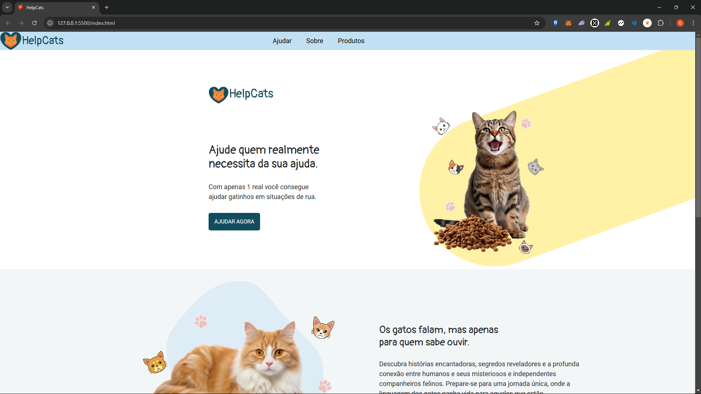
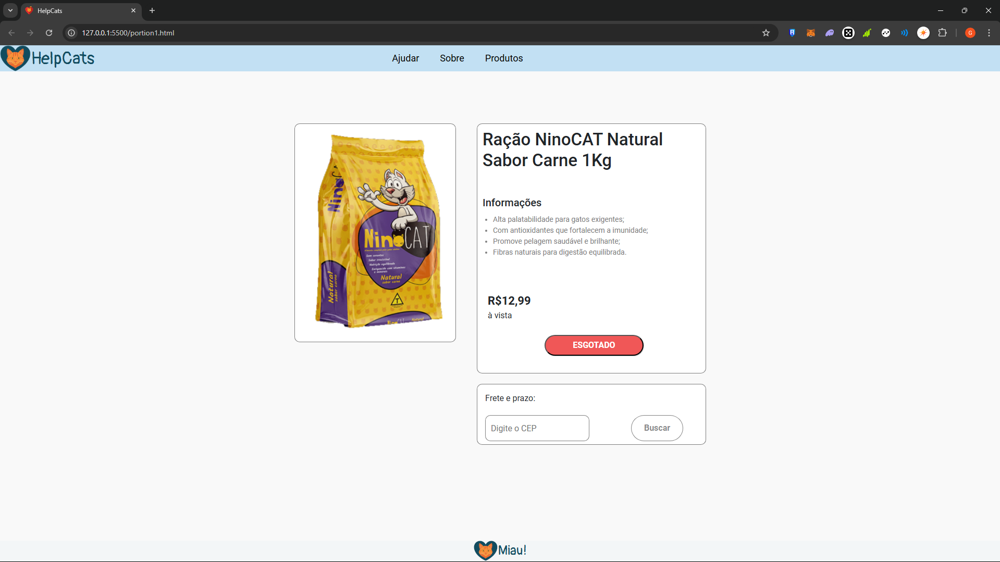
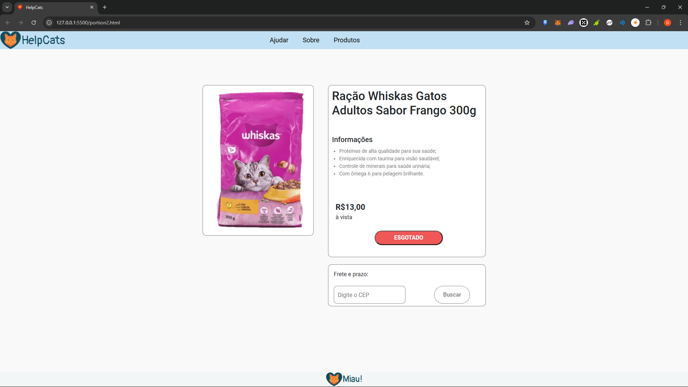
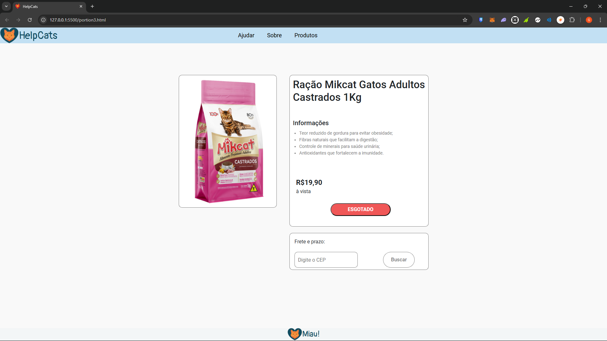
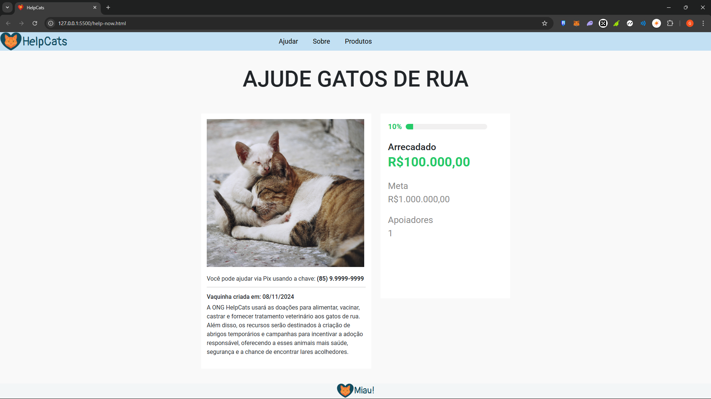

# site-gatos

Site feito com HTML, CSS e um pouco de Bootstrap. Sobre uma ONG que ajuda Gatos de rua. Em seu menu é possível ver 3 opções (Ajudar, Sobre e Produtos). Todos os botões do menu são clicáveis, inclusive a logo "Help Cats" que ao clica-la será direcionado a página principal do site.

Menu -> Ajudar: ao clicar será direcionado para uma área para que você possa realizar uma doação para poder ajudar a causa, podendo ver tanto o valor arrecadado quanto a quantidade de apoiadores.

Menu -> Sobre: ao clicar será direcionado ao meio da página principal, onde pode-se ler um pouco sobre os queridos felinos, junto com um botão "Saiba mais", que ao clicar nele será direcionado a um vídeo do youtube que fala também sobre os tão queridos felinos.

Menu -> Produtos: ao clicar será direcionado ao final da página, onde pode-se encontrar os produtos que a ONG revende e todo valor arrecadado é convertido para ajudar os gatos resgatados, junto a cada produto há um botão "Comprar agora" que ao clicar será direcionado para a página do produto em questão.

OBS: Nenhum Gato presente no site sofreu qualquer tipo de estresse ou judiação ao tirar as fotos.

